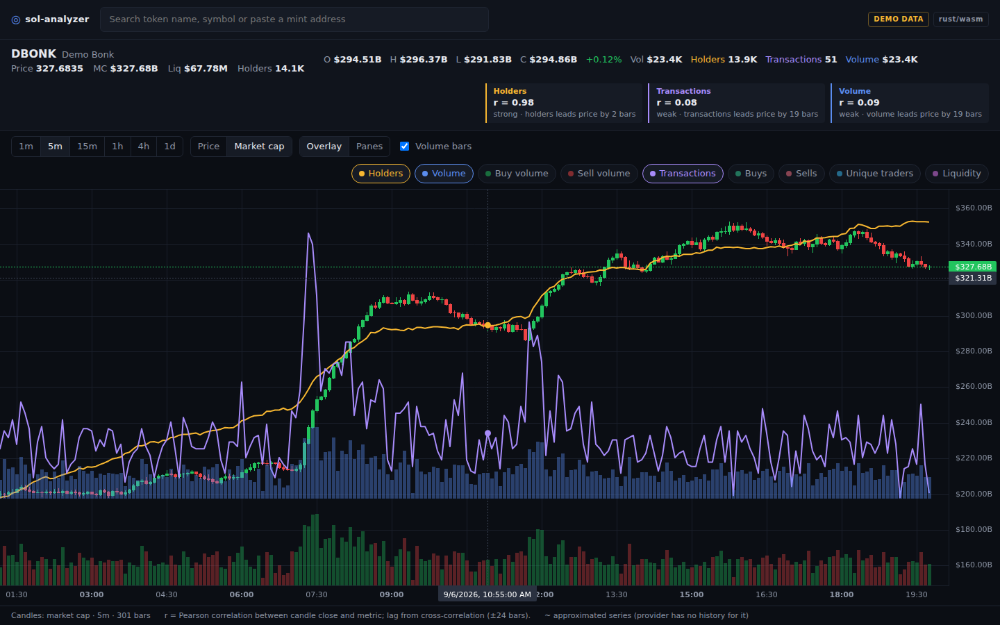
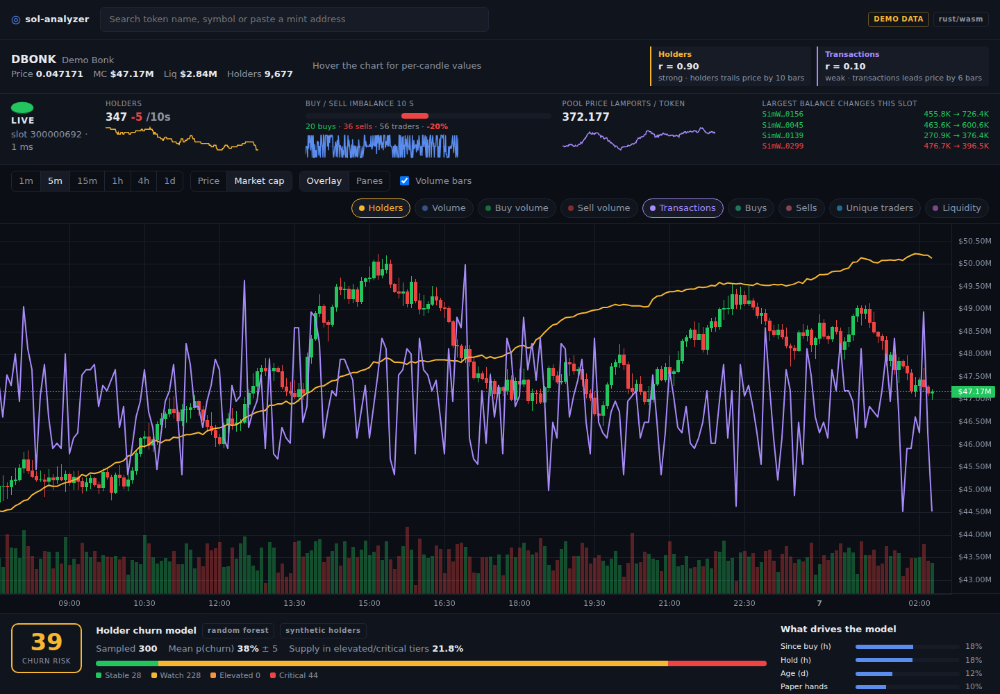
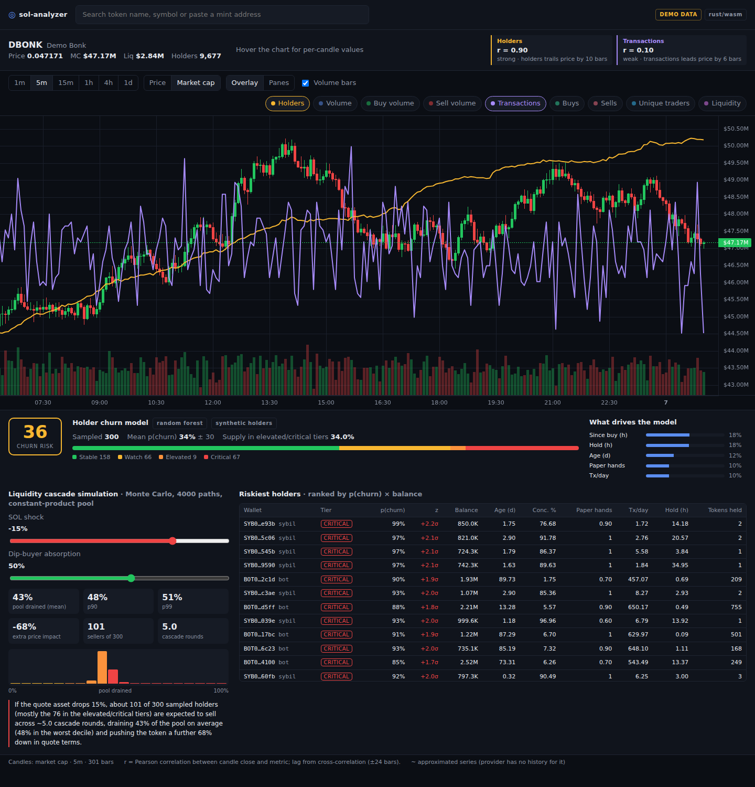

# sol-analyzer

An Axiom-style Solana token terminal focused on one question: **how does on-chain
activity move with price?** The main pane draws price or market-cap candles; the
user overlays any mix of holder count, volume, buy/sell counts, unique traders and
liquidity, either floating on the candles or in synced sub-panes, and gets a
correlation and lead/lag read-out for each.



## Architecture

| Layer | Language | Path | Role |
|---|---|---|---|
| Web client | TypeScript / React | `web/` | Vite app, `lightweight-charts` v5 multi-pane chart, metric picker, hover legend |
| Analytics | Rust → WebAssembly | `analytics/` | Pearson, cross-correlation lead/lag scan, rolling correlation, run in the browser |
| API | Python / FastAPI | `api/` | Token search, candles, metric series; caching; pluggable data providers |
| Aggregation + simulation | C++ | `native/` | Resamples candles, buckets raw trade feeds into per-candle metrics, and runs the Monte Carlo liquidity cascade; loaded by the API via `ctypes` |
| Live stream | Rust | `stream/` | Geyser gRPC consumer keeping per-token holder state, one WebSocket delta per slot |
| Predictive engine | Python | `api/ml/` | RPC/mock holder collection, feature engineering, Random Forest / XGBoost churn classifier, risk tiers |

Both native pieces have fallbacks: the API uses a pure-Python path if
`libsolagg.so` is not built, and the client uses a TypeScript implementation if
the wasm fails to load. The badge in the top-right shows which is active.

### Data providers

* **Solana Tracker** (`SOLANATRACKER_API_KEY`): OHLCV in price or market-cap
  terms, holder-count history, and the trade feed that becomes transactions,
  buys/sells, buy/sell volume and unique traders. Liquidity has no history
  endpoint on the free tier, so it is drawn dotted as a flat current value.
* **DexScreener** (no key): token search fallback in demo mode.
* **Mock**: deterministic two weeks of minute data per mint with holder count
  generated to trail price, so the app is fully usable with no keys.

## Quick start

```bash
make setup      # npm deps, python deps, wasm target + wasm-bindgen CLI
make build      # C++ lib, Rust->wasm bindings, web bundle
make test       # all four test suites
make dev        # API on :8787 and Vite on :5173 (proxies /api)
```

For live data:

```bash
cp .env.example .env    # add SOLANATRACKER_API_KEY and optionally SOLANA_RPC_URL
set -a; . ./.env; set +a
make serve              # API serves the built client on :8787
```

Prerequisites: Node 20+, Python 3.11+, a C++17 compiler with CMake, Rust stable.

## Deploying

The web client runs on **Cloudflare Workers**; the API and a **Solana RPC node** run on
**AWS** (Terraform in `infra/aws`, container in `Dockerfile`). See
[docs/deployment.md](docs/deployment.md).

## Using it

* Search by name/symbol or paste a mint and press Enter.
* Pick the interval (1m … 1d) and whether candles show **price** or **market cap**.
* Toggle metrics. **Overlay** floats each on its own hidden scale so shapes are
  comparable regardless of magnitude; **Panes** gives each a synced sub-chart.
* The stats bar shows `r` (Pearson correlation of candle close vs. the metric)
  and the lag at which |r| peaks, phrased as "holders trail price by N bars" or
  "leads". The URL hash encodes token and metrics for sharing.

## Live holder stream

A strip above the chart shows holder count, buy/sell imbalance, pool price and the
largest balance changes updated every slot (~400 ms) from a Geyser subscription, and
the holders overlay's last bucket moves with it. See
[docs/live-stream.md](docs/live-stream.md). Without a Geyser endpoint the service
runs a simulated feed.



## Predictive engine

Below the chart, a holder-risk panel scores the token's holders with a churn
classifier and stress-tests the pool with a Monte Carlo cascade.



* **Raw data** per holder wallet straight from a Solana RPC node (`SOLANA_RPC_URL`),
  or a synthetic archetype population offline: balances, transfer timestamps,
  first activity slot, counterparties, tokens held, trades.
* **Features**: wallet age, ecosystem footprint, average hold time, tx/day, token
  velocity, concentration %, paper-hand ratio, sentiment alignment.
* **Classifier**: Random Forest vs XGBoost with cross-validation; `make train`
  refits and saves the better model. Holders are tiered by standard deviations
  from the population mean.
* **Cascade**: the C++ kernel simulates a SOL shock through a constant-product
  pool, holders selling as their panic thresholds trip, and dip-buyer absorption,
  reporting pool drainage percentiles and a narrative.

See [docs/predictive-engine.md](docs/predictive-engine.md) for formulas and assumptions.

## API

```
GET /api/status
GET /api/search?q=
GET /api/token/{mint}
GET /api/chart/{mint}?interval=5m&mode=price|marketCap&from=&to=
GET /api/metric/{mint}?metric=holders&interval=5m&from=&to=
GET /api/risk/{mint}?limit=300
GET /api/cascade/{mint}?shock=-15&absorption=0.5&sims=4000
```

Metrics: `holders volume buyVolume sellVolume txns buys sells traders liquidity`.
Responses carry `approximated: true` when the provider could not supply real
history for the range (e.g. the trade feed page cap was hit).

## Layout

```
web/src/components/Chart.tsx     multi-pane chart, overlay/pane layouts
web/src/lib/analytics.ts         wasm loader + TS fallback
web/src/wasm/                    generated by analytics/build.sh (committed)
analytics/src/lib.rs             Rust analytics + unit tests
api/main.py                      FastAPI routes
api/native.py                    ctypes bridge + Python fallback
api/providers/                   mock, solanatracker, dexscreener
api/ml/                          raw collectors, features, train, engine, routes, live bridge
stream/src/geyser.rs             Yellowstone subscription + SPL account / trade decoding
stream/src/state.rs              per-token holder state and slot deltas
web/src/components/LiveStrip.tsx live holders / imbalance strip
native/aggregator.cpp            C++ resampling / trade bucketing
native/cascade.cpp               C++ Monte Carlo liquidity cascade
web/src/components/RiskPanel.tsx holder-risk panel + cascade sliders
```
